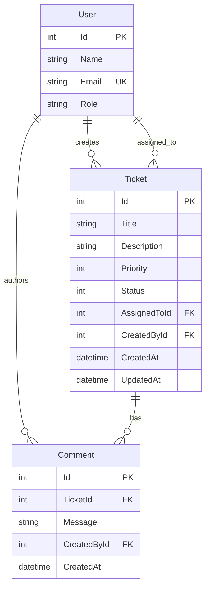

# Data Model

Part C — Submission artifact for the .NET AI Capability Assessment.  
Adapted from [`docs/data-model.md`](docs/data-model.md). Scope: **Core only**.

**Traces to:** [`requirements-analysis.md`](requirements-analysis.md), [`design-notes.md`](design-notes.md), [`docs/architecture.md`](docs/architecture.md)

Logical data model for the Core implementation. Three entities — User, Ticket, and Comment — persisted in SQLite. The model supports keyword search, status filtering, user references for creator and assignee, and append-only comments.

---

## Entities and Purpose

| Entity | Purpose |
|--------|---------|
| **User** | Seeded internal users selectable as ticket creator and assignee; read-only in Core |
| **Ticket** | Primary aggregate — support request with lifecycle status, priority, and ownership |
| **Comment** | Append-only messages attached to a ticket |

---

## Entity Attributes

### User

| Attribute | Data Type | Required | Notes |
|-----------|-----------|----------|-------|
| Id | `int` | Yes | PK, auto-generated |
| Name | `string` (max 100) | Yes | Display name |
| Email | `string` (max 256) | Yes | Unique |
| Role | `string` (max 50) | Yes | e.g., Agent, Manager |

### Ticket

| Attribute | Data Type | Required | Notes |
|-----------|-----------|----------|-------|
| Id | `int` | Yes | PK, auto-generated |
| Title | `string` (max 200) | Yes | BR-04 |
| Description | `string` (max 4000) | No | Searchable; empty allowed |
| Priority | `int` | Yes | Enum: Low (0), Medium (1), High (2) |
| Status | `int` | Yes | Enum: Open (0), InProgress (1), Resolved (2), Closed (3), Cancelled (4); default Open |
| AssignedToId | `int` | Yes | FK → User.Id |
| CreatedById | `int` | Yes | FK → User.Id |
| CreatedAt | `DateTime` (UTC) | Yes | Set on create |
| UpdatedAt | `DateTime` (UTC) | Yes | Set on create and update |

### Comment

| Attribute | Data Type | Required | Notes |
|-----------|-----------|----------|-------|
| Id | `int` | Yes | PK, auto-generated |
| TicketId | `int` | Yes | FK → Ticket.Id |
| Message | `string` (max 4000) | Yes | BR-05 |
| CreatedById | `int` | Yes | FK → User.Id |
| CreatedAt | `DateTime` (UTC) | Yes | Set on create |

### Enum Values

**TicketStatus**

| Value | Stored as |
|-------|-----------|
| Open | 0 |
| InProgress | 1 |
| Resolved | 2 |
| Closed | 3 |
| Cancelled | 4 |

**Priority**

| Value | Stored as |
|-------|-----------|
| Low | 0 |
| Medium | 1 |
| High | 2 |

Enums are stored as `int` in the database; domain enums in the Application layer map to these values.

---

## Entity Relationships

| Relationship | Cardinality | Foreign Key | Delete Behavior |
|--------------|-------------|-------------|-----------------|
| User → Ticket (creator) | 1:N | Ticket.CreatedById | Restrict |
| User → Ticket (assignee) | 1:N | Ticket.AssignedToId | Restrict |
| Ticket → Comment | 1:N | Comment.TicketId | Cascade |
| User → Comment (author) | 1:N | Comment.CreatedById | Restrict |

**Primary keys:** User.Id, Ticket.Id, Comment.Id

**Foreign keys:**

- Ticket.AssignedToId → User.Id
- Ticket.CreatedById → User.Id
- Comment.TicketId → Ticket.Id
- Comment.CreatedById → User.Id

Restrict on User foreign keys: users are seeded and referenced by tickets and comments; user deletion is not supported in Core.

---

## Entity Relationship Diagram

---

## Index Recommendations

| Index | Column(s) | Justification |
|-------|-----------|---------------|
| PK (clustered) | Each Id | Default primary key access |
| IX_Ticket_Status | Ticket.Status | Status filter (FR-12, AC-08) |
| UQ_User_Email | User.Email | Uniqueness for seeded users; lookup integrity |

**Not indexed (with rationale):**

- **Title / Description** — keyword search uses LIKE on a small dataset; full-text index unnecessary at assessment scale
- **AssignedToId** — filter by assignee is Stretch scope, not Core

Foreign key columns are indexed automatically by the persistence layer; no additional FK indexes documented.

---

## Seed Data Strategy

| Data | Required | When | Content |
|------|----------|------|---------|
| Users | Yes | Application startup (after migration) | 3–5 users with varied roles (Agent, Manager) |
| Tickets | Optional | Startup | 2–3 sample tickets in mixed statuses for demo and search |
| Comments | Optional | Startup | 1–2 comments on sample tickets |

**Approach:**

- Seed logic lives in Infrastructure (per design-notes / architecture); this section documents strategy only
- Idempotent seed: check if users exist before inserting (safe on restart)
- Users must be seeded before any ticket or comment seed data
- Seed data description also documented in `database/setup-notes.md`
- No credentials or secrets in seed data

---

## Migration Strategy

1. **Initial migration** — creates User, Ticket, and Comment tables with primary keys, foreign keys, and justified indexes
2. **Location** — migration files under Infrastructure Persistence; mirrored in `database/schema-or-migrations/` for assessment visibility
3. **Apply on startup** — application applies pending migrations before seeding (development and test)
4. **Version control** — migrations committed alongside related schema changes
5. **Local SQLite only** — assessment uses a local database file; production deployment patterns are out of scope
6. **Test database** — integration tests use a separate SQLite file or in-memory provider with the same schema via migrations

Operator-facing setup steps: `database/setup-notes.md`.

---

## Design Decisions and Assumptions

| Decision / Assumption | Rationale |
|-----------------------|-----------|
| Integer primary keys (`int`) | Simple, SQLite-friendly, sufficient for assessment scale |
| Enum values stored as `int` | Compact storage; domain enums map in Application layer |
| UTC timestamps | Avoids timezone ambiguity; set by application on write |
| User.Email unique | Data integrity for seeded users; prevents duplicate references |
| No soft delete on Ticket | Ticket deletion not in Core; missing tickets treated as not found |
| Comments cascade delete with Ticket | Ticket delete not exposed in Core; simplifies referential integrity if added later |
| Separate AssignedToId and CreatedById FKs | Matches assessment fields; supports distinct creator vs assignee |
| Title max 200, Description max 4000 | Reasonable limits; supports validation without over-constraining |
| Priority required on create | Per AC-01 — missing priority rejected |
| Status defaults to Open on insert | FR-02 |
| Comments are append-only | No edit or delete of comments in Core |

---

## Traceability to Core Requirements

| Requirement | Data Model Support |
|-------------|-------------------|
| FR-01, FR-02 Create ticket | Ticket entity with all required fields; Status defaults to Open |
| FR-03 List tickets | Ticket table with persisted rows |
| FR-04, FR-10 View detail + comments | Ticket fields + Comment relationship via TicketId |
| FR-05 Update ticket | Mutable Ticket fields with UpdatedAt |
| FR-06–08 Status lifecycle | Ticket.Status column; transition rules enforced in Application layer |
| FR-09, FR-10 Add comments | Comment entity with TicketId and CreatedById FKs |
| FR-11 Keyword search | Ticket.Title and Ticket.Description columns |
| FR-12 Status filter | Ticket.Status column; IX_Ticket_Status index |
| FR-14 Persistence | All three entities in SQLite |
| FR-15, FR-16 Seeded users | User entity; seed-only population |
| BR-06 User references | FK constraints on CreatedById, AssignedToId, Comment.CreatedById |
| BR-07 Read-only users | No user mutation in Core; seed-only writes |

Source detail remains in [`docs/data-model.md`](docs/data-model.md).
