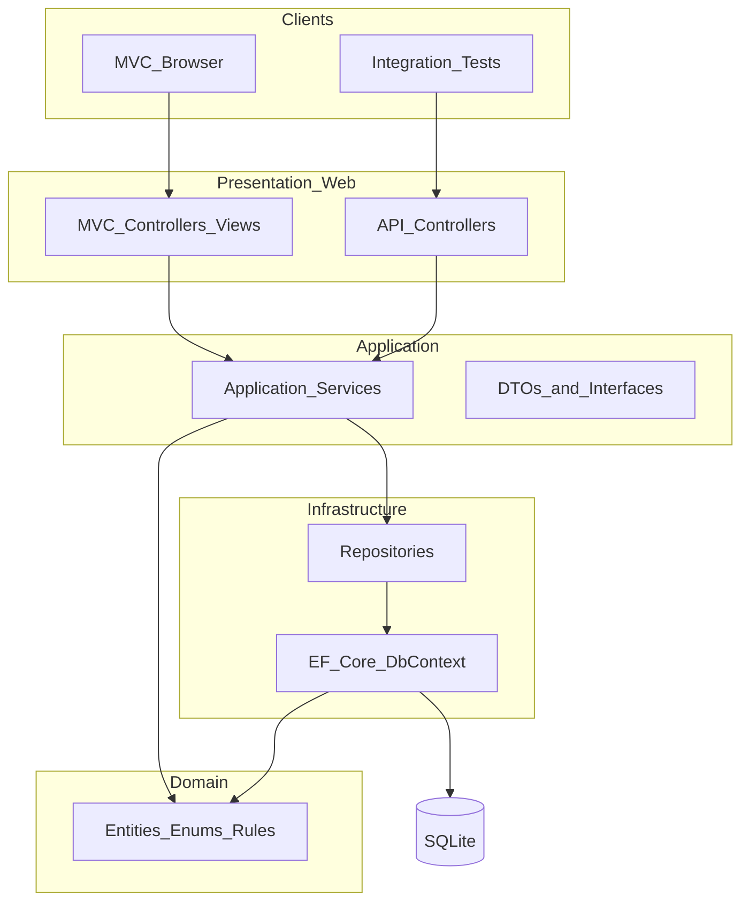
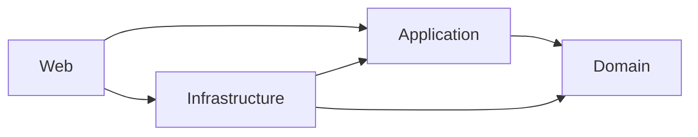

# Design Notes

Part C — Submission artifact for the .NET AI Capability Assessment.  
Consolidated from [`docs/architecture.md`](docs/architecture.md) (and related design docs). Scope: **Core only**.

**Traces to:** [`requirements-analysis.md`](requirements-analysis.md), [`tool-specific/cursor-workflow/project-context.md`](tool-specific/cursor-workflow/project-context.md), [`docs/architecture.md`](docs/architecture.md), [`docs/test-strategy.md`](docs/test-strategy.md)

---

## Architecture Overview

A single deployable ASP.NET Core application hosts both the MVC UI and Web API, backed by SQLite via EF Core, organized in four logical layers following lightweight Clean Architecture.

The system serves two clients: a browser-based MVC UI (primary) and integration tests that exercise the Web API. Both presentation entry points delegate to the same Application services, which orchestrate use cases against Domain entities and Infrastructure repositories. State machine enforcement lives in Domain and Application — not in controllers or views.



### Solution structure

```
SupportTicketManagement.sln
src/
  SupportTicketManagement.Domain/
  SupportTicketManagement.Application/
  SupportTicketManagement.Infrastructure/
  SupportTicketManagement.Web/
tests/
  SupportTicketManagement.Tests/
database/
docs/
```

| Project | Type | References |
|---------|------|------------|
| SupportTicketManagement.Domain | Class library | None |
| SupportTicketManagement.Application | Class library | Domain |
| SupportTicketManagement.Infrastructure | Class library | Application, Domain |
| SupportTicketManagement.Web | ASP.NET Core web | Application, Infrastructure |
| SupportTicketManagement.Tests | xUnit test project | Application, Infrastructure, Web |

### Dependency flow

Dependencies point inward. Inner layers have no knowledge of outer layers.



**Composition root:** Web registers Application services and Infrastructure implementations at startup.  
**Interface placement:** Service and repository interfaces in Application; implementations in Infrastructure.  
**Data flow:** Presentation maps input to DTOs, calls Application services, and renders results. Application calls repositories through interfaces; repositories use EF Core against Domain entities.

### Key design decisions

| Decision | Rationale |
|----------|-----------|
| Lightweight Clean Architecture (4 layers) | Separated concerns and testability without enterprise overhead (NFR-09) |
| Single Web project hosting MVC and API | One deployable unit; API for tests and future clients; MVC primary UI |
| MVC and API both call Application services | No HTTP loopback for MVC; shared business logic; API independently testable |
| State machine in Domain; enforcement in Application | Signature judgment (BR-01–BR-03); rules out of controllers and Razor |
| Repository abstraction over DbContext | Persistence out of use cases; minimal interface count |
| DTOs at Application boundary | Controllers never expose entities |
| SQLite | Local DB; no external server for setup (NFR-02) |
| Feature folders within layers | Groups ticket/comment/user concerns for Core scope |

Full narrative: [`docs/architecture.md`](docs/architecture.md).

---

## Frontend Design

**Stack:** ASP.NET Core MVC + Bootstrap 5. No SPA; server-rendered views.

**Presentation owns:** HTTP handling, routing, view rendering, input binding, and error display. Must not contain business rules, EF queries, or direct entity exposure to views.

**Web project layout:** Controllers, Api, Views, ViewModels, Middleware.

**Screens (see [`ui-flow.md`](ui-flow.md)):**

| Screen | Purpose |
|--------|---------|
| Dashboard / Ticket List | Browse, search, filter; default landing (no login in Core) |
| Create Ticket | New ticket form |
| Ticket Details | Full ticket, comments, status change, add comment |
| Edit Ticket | Update title, description, priority, assignee (status read-only) |

Change status and add comment are sections on Ticket Details, not separate pages. Layout includes application title and a link back to the ticket list. Controllers stay thin and call Application services directly.

**UI principles:**

- Server-side validation authoritative; client-side supplementary (NFR-04)
- Field-level errors and validation summary; forms retain values on failure
- Success redirects/refreshes with confirmation messages
- Only valid next statuses offered; terminal states (Closed, Cancelled) hide transition UI
- No stack traces or internal details in user-facing messages (AC-10)

---

## Backend Design

### Layer responsibilities

| Layer | Owns | Must not contain |
|-------|------|------------------|
| **Presentation** | HTTP, routing, views, binding, error display | Business rules, EF queries, entity exposure to views |
| **Application** | Use cases, DTO mapping, validation orchestration, contracts | EF DbContext, Razor, HTTP-specific logic |
| **Domain** | Entities, enums, domain exceptions, state machine rules | Framework dependencies, persistence |
| **Infrastructure** | Data access, migrations, seeding, repository implementations | Business rule decisions, UI concerns |

### Project responsibilities (summary)

- **Domain:** Ticket, Comment, User; TicketStatus, Priority; transition rules; domain exceptions
- **Application:** Use-case services/interfaces; request/response DTOs; validation and rule enforcement coordination
- **Infrastructure:** DbContext, configurations, repositories, migrations, startup seed
- **Web:** MVC + API controllers, DI composition root, middleware/global exception handling
- **Tests:** Integration tests (mandatory state-machine tier) via WebApplicationFactory

### Design principles

- Thin controllers — all use cases in Application services
- Business logic in Application and Domain, never in Razor
- Expected business failures return explicit results (validation, invalid transitions), not unhandled exceptions
- One DbContext in Infrastructure; async I/O for data access
- No authentication in Core (BR-09) — operations open by design
- Minimal abstractions — interfaces where they aid testing or swapping implementations

API shapes and status codes: [`api-contract.md`](api-contract.md).

---

## Database Design

Logical model: **User**, **Ticket**, and **Comment** in SQLite. Supports keyword search, status filtering, creator/assignee references, and append-only comments. Detail: [`data-model.md`](data-model.md).

| Entity | Purpose |
|--------|---------|
| **User** | Seeded internal users as creator/assignee; read-only in Core |
| **Ticket** | Primary aggregate — status, priority, ownership |
| **Comment** | Append-only messages on a ticket |

**Relationships:** User 1:N Ticket (creator and assignee, Restrict); Ticket 1:N Comment (Cascade); User 1:N Comment author (Restrict).

**Persistence choices:**

- Integer PKs; enums stored as `int`; UTC timestamps set by application
- Indexes: PK on each Id; `IX_Ticket_Status` for filter; unique `User.Email`
- Idempotent user seed (3–5 users) on startup after migrations; optional sample tickets/comments
- Initial migration under Infrastructure; apply pending migrations on startup; test DB uses same schema

Operator notes: `database/setup-notes.md`.

---

## Validation Strategy

- **Authoritative layer:** Application services enforce field rules and business rules before persist
- **API:** Reject invalid input with `400` and `ErrorResponse` (`title`, `status`, `errors[]` with field/message)
- **MVC:** Field-level messages beside inputs plus validation summary; whitespace-only treated as empty
- **References:** Assigned/created user IDs must exist (`404` when missing)
- **Status changes:** Target must be a valid enum and an allowed transition from current status (`409` when invalid)

| Field | Rules (Core) |
|-------|----------------|
| title | Required on create/update; non-empty; max 200 |
| description | Optional; max 4000 |
| priority | Required on create/update; valid enum |
| assignedToId / createdById | Required where applicable; existing user |
| status (PATCH) | Required; valid enum; allowed transition |
| message | Required on comment; non-empty; max 4000 |
| search / status (query) | Optional; empty search = no filter; invalid status query → 400 |

Client-side checks are supplementary only (NFR-04, AC-09). Full tables: [`api-contract.md`](api-contract.md), [`ui-flow.md`](ui-flow.md).

---

## Error Handling Strategy

| Scenario | API | MVC / UX |
|----------|-----|----------|
| Validation failure | 400 + ErrorResponse | Field errors + summary; retain entered values |
| Ticket or user not found | 404 | Not-found message with link to ticket list |
| Invalid status transition | 409 with clear message | Prominent error on details; status unchanged |
| Unhandled server error | 500 without internal details | Generic friendly message |

**Cross-cutting:**

- Global exception handler in Web; no stack traces or internal details to clients (NFR-06, AC-10)
- Expected business failures prefer explicit results over exceptions where practical
- Success paths: create/edit redirect to details with confirmation; status/comment refresh details with confirmation

---

## Testing Strategy Link

Full strategy: [`docs/test-strategy.md`](docs/test-strategy.md). Results: [`tool-specific/cursor-workflow/test-results.md`](tool-specific/cursor-workflow/test-results.md).

**Core approach:**

- **Primary:** xUnit integration tests with `WebApplicationFactory` against the Web project
- **Mandatory tier:** State machine — valid transitions return success; invalid transitions return `409` and leave status unchanged
- **Supporting:** Backend validation (400/404), search/filter on list endpoint, error-shape checks
- **Out of Core:** Unit-test suite, UI automation, Stretch coverage
- **Execution:** `dotnet test` from solution root; evidence for assessment criterion #11

Related plan phases: Phases 5, 7, and 8 in [`implementation-plan.md`](implementation-plan.md).
