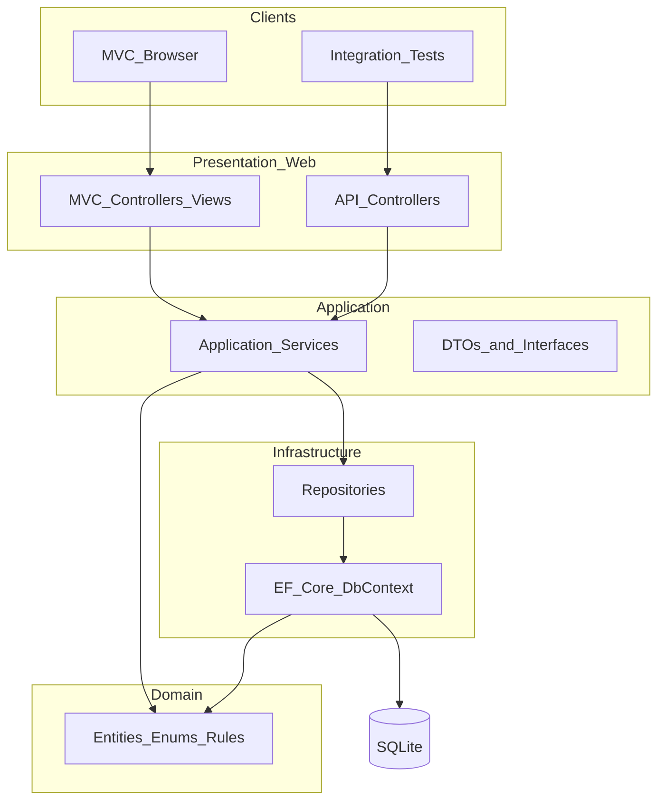
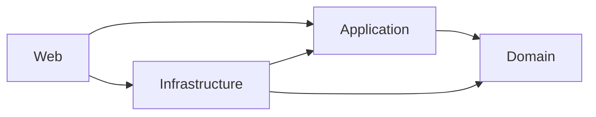

# Architecture

**Scope:** Core only  
**Traces to:** [project-context.md](../tool-specific/cursor-workflow/project-context.md), [requirements-analysis.md](requirements-analysis.md)

Proposed solution architecture for the Core implementation of the Support Ticket Management System. A single deployable ASP.NET Core application hosts both the MVC UI and Web API, backed by SQLite via EF Core, organized in four logical layers following lightweight Clean Architecture.

---

## High-Level Architecture Overview

The system serves two clients: a browser-based MVC UI (primary) and integration tests that exercise the Web API. Both presentation entry points delegate to the same Application services, which orchestrate use cases against Domain entities and Infrastructure repositories. State machine enforcement lives in Domain and Application — not in controllers or views.



---

## Solution Structure

```
SupportTicketManagement.sln
src/
  SupportTicketManagement.Domain/
  SupportTicketManagement.Application/
  SupportTicketManagement.Infrastructure/
  SupportTicketManagement.Web/
tests/
  SupportTicketManagement.Tests/
database/
docs/
```

| Project | Type | References |
|---------|------|------------|
| SupportTicketManagement.Domain | Class library | None |
| SupportTicketManagement.Application | Class library | Domain |
| SupportTicketManagement.Infrastructure | Class library | Application, Domain |
| SupportTicketManagement.Web | ASP.NET Core web | Application, Infrastructure |
| SupportTicketManagement.Tests | xUnit test project | Application, Infrastructure, Web |

---

## Project Responsibilities

### SupportTicketManagement.Domain

- Core entities: Ticket, Comment, User
- Enums: TicketStatus, Priority
- Domain exceptions for expected business failures
- Status transition rules (finite state machine definition)

### SupportTicketManagement.Application

- Use-case services and their interfaces
- Request and response DTOs
- Validation orchestration and business rule enforcement coordination
- Repository and service contracts (interfaces)

### SupportTicketManagement.Infrastructure

- EF Core DbContext and entity configurations
- Repository implementations
- Database migrations
- Seed data execution at startup

### SupportTicketManagement.Web

- MVC controllers, views, and view models
- API controllers
- Dependency injection composition root
- Middleware and global exception handling
- Bootstrap 5 static assets

### SupportTicketManagement.Tests

- Integration tests (mandatory state-machine tier)
- References Web project for test host setup

---

## Layer Responsibilities

| Layer | Owns | Must not contain |
|-------|------|------------------|
| **Presentation** | HTTP handling, routing, view rendering, input binding, error display to user | Business rules, EF queries, direct entity exposure to views |
| **Application** | Use cases, DTO mapping, validation orchestration, service and repository contracts | EF DbContext, Razor markup, HTTP-specific logic |
| **Domain** | Entities, enums, domain exceptions, state machine rules | Framework dependencies, persistence logic |
| **Infrastructure** | Data access, migrations, seeding, repository implementations | Business rule decisions, UI concerns |

---

## Dependency Flow

Dependencies point inward. Inner layers have no knowledge of outer layers.



**Composition root:** Web registers Application services and Infrastructure implementations at application startup.

**Interface placement:** Service and repository interfaces are defined in Application; implementations live in Infrastructure.

**Data flow:** Presentation receives input, maps to DTOs, calls Application services, receives results, and renders responses. Application services call repositories through interfaces; repositories use EF Core to read and write Domain entities.

---

## Folder Structure

Feature-grouped folders within each project:

**Domain**

```
Entities/
Enums/
Exceptions/
Services/
```

**Application**

```
Tickets/
Comments/
Users/
Common/
Interfaces/
```

**Infrastructure**

```
Persistence/
Repositories/
Seeding/
```

**Web**

```
Controllers/
Api/
Views/
ViewModels/
Middleware/
```

**Tests**

```
Integration/
```

---

## Design Decisions and Rationale

| Decision | Rationale |
|----------|-----------|
| Lightweight Clean Architecture (4 layers) | Assessment requires separated concerns and testability without enterprise overhead; aligns with NFR-09 |
| Single Web project hosting MVC and API | One deployable unit; API enables integration tests and future clients; MVC is the primary UI per requirements |
| MVC and API both call Application services directly | Avoids HTTP loopback for server-rendered UI; shared business logic; API remains independently testable |
| State machine in Domain with enforcement in Application | Signature judgment piece (BR-01–BR-03); keeps transition rules out of controllers and Razor views |
| Repository abstraction over raw DbContext in Application | Keeps persistence out of use cases; enables testability; minimal interface count per project conventions |
| DTOs at the Application boundary | Controllers never expose entities; enforces validation and mapping separation |
| SQLite for persistence | Assessment-accepted local database; no external server dependency for setup (NFR-02) |
| Feature folders within layers | Groups ticket, comment, and user concerns; scales without over-engineering for Core scope |

---

## Key Design Principles

- Dependencies point inward; Domain has no outward project references
- Thin controllers — all use cases delegate to Application services
- Business logic lives in Application and Domain, never in Razor views
- Server-side validation is authoritative; client-side checks are supplementary (NFR-04)
- Expected business failures (validation errors, invalid transitions) return explicit results rather than unhandled exceptions
- One DbContext in Infrastructure; no EF Core usage in controllers
- Async I/O for all data access operations
- No authentication in Core (BR-09) — all operations are open by design
- Keep abstractions minimal — interfaces only where they aid testing or swapping implementations
- Prefer the simplest structure that meets Core acceptance criteria within assessment time constraints
