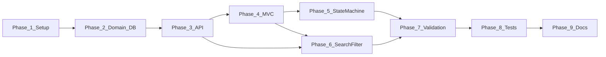

# Implementation Plan

**Scope:** Core only  
**Traces to:** [architecture.md](architecture.md), [api-contract.md](api-contract.md), [ui-flow.md](ui-flow.md), [acceptance-criteria.md](acceptance-criteria.md)

**Status:** Core phases 1–9 complete. Build and integration tests pass. See `tool-specific/cursor-workflow/test-results.md`.

Phased delivery plan for the Core implementation (~5 focused hours of application work). Each phase produces a verifiable increment. Stretch features are deferred until all Core acceptance criteria pass.

---

## Phase Sequencing

State machine rules are defined in Domain during Phase 2 and fully enforced in Phase 5. Search and filter extend the existing list endpoint in Phase 6. Validation is hardened in Phase 7 after features exist. Integration tests run in Phase 8 once the state machine and validation are complete.

---

## Phase 1: Solution and Project Setup

### Objective

Establish solution structure, project references, and the DI composition root per [architecture.md](architecture.md).

### Deliverables

- Solution file with Domain, Application, Infrastructure, Web, and Tests projects
- Correct project references and dependency direction
- Feature-grouped folder structure in each project
- SQLite connection placeholder in configuration (no secrets committed)
- README stub with planned setup and run instructions

### Dependencies

- [architecture.md](architecture.md)
- [`.cursor/rules/project-rules.md`](../.cursor/rules/project-rules.md)

### Expected Outcome

Solution builds cleanly. `dotnet build` succeeds. Project layout matches the approved architecture.

---

## Phase 2: Domain Model and Database

### Objective

Implement Domain entities, enums, and the persistence layer per [data-model.md](data-model.md).

### Deliverables

- User, Ticket, and Comment entities
- TicketStatus and Priority enums
- State transition rule definition in Domain
- DbContext, entity configurations, and initial EF Core migration
- Idempotent user seed data; optional sample tickets and comments
- Draft of `database/setup-notes.md`

### Dependencies

- Phase 1
- [data-model.md](data-model.md)

### Expected Outcome

Database is created on application startup. Seeded users are available. Migrations are committed. Data persists across application restart.

---

## Phase 3: Backend API

### Objective

Expose Core REST endpoints per [api-contract.md](api-contract.md) through Application services and API controllers.

### Deliverables

- Application service interfaces, DTOs, and repository implementations
- API controllers for ticket create, list, detail, update, and comment create
- End-to-end API flows for CRUD and comments
- Status PATCH endpoint stubbed or basic (full enforcement in Phase 5)

### Dependencies

- Phase 2
- [api-contract.md](api-contract.md)

### Expected Outcome

Core CRUD and comment operations are callable via API. JSON responses match contract shapes. Application services are ready for MVC consumption.

---

## Phase 4: MVC UI

### Objective

Implement the server-rendered UI per [ui-flow.md](ui-flow.md), calling Application services directly.

### Deliverables

- MVC controllers and view models
- Views for ticket list, create, details, and edit
- Layout with navigation back to ticket list
- Bootstrap 5 styling applied
- Working browser flows: create, list, view, edit tickets, and add comments

### Dependencies

- Phase 3 (Application services stable)
- [ui-flow.md](ui-flow.md)

### Expected Outcome

User can create, list, view, edit tickets, and add comments through MVC. Matches UI-01 through UI-04 and UI-06. Status change UI deferred to Phase 5.

---

## Phase 5: State Machine

### Objective

Enforce the ticket status state machine server-side and expose it through API and MVC (signature judgment piece).

### Deliverables

- Transition validation in Application layer using Domain rules
- Fully implemented `PATCH /api/tickets/{id}/status` (409 on invalid transition)
- Status change section on ticket details per ui-flow.md
- UI shows only valid next statuses based on current state

### Dependencies

- Phase 3, Phase 4
- BR-01 through BR-03; AC-05

### Expected Outcome

All five valid transitions succeed. Invalid transitions are rejected with clear feedback in API and MVC. Terminal states (Closed, Cancelled) show no transition options.

---

## Phase 6: Search and Filtering

### Objective

Add keyword search and status filter to the ticket list per FR-11, FR-12, and FR-13.

### Deliverables

- Query parameters on list API (`search`, `status`)
- Repository query supporting combined filters
- Search and filter controls on ticket list UI
- Empty-result state when no matches

### Dependencies

- Phase 3 (list endpoint), Phase 4 (list UI)
- API-07, API-08 in [api-contract.md](api-contract.md)

### Expected Outcome

User can search by keyword, filter by status, and combine both. Empty keyword returns all tickets. No matches shows empty-state message.

---

## Phase 7: Validation and Error Handling

### Objective

Harden server-side validation and user-facing error states across API and MVC.

### Deliverables

- Validation on all create, update, comment, and status inputs per api-contract validation table
- Consistent ErrorResponse from API
- Field-level and summary errors in MVC forms
- Not-found handling for missing tickets and users
- Global exception handler; no stack traces exposed to users

### Dependencies

- Phases 3 through 6
- AC-09, AC-10

### Expected Outcome

Invalid input is rejected before persist. Meaningful error messages for validation failures, not-found, and invalid transitions. Forms retain entered values on failure.

---

## Phase 8: Integration Testing

### Objective

Satisfy the mandatory test tier — state machine integration tests.

### Deliverables

- xUnit integration tests using WebApplicationFactory
- Tests proving valid transitions succeed and invalid transitions return 409
- `test-results.md` with run output
- All tests pass via `dotnet test`

### Dependencies

- Phase 5 (state machine complete), Phase 7
- Assessment criterion #11

### Expected Outcome

State-machine integration tests pass. Test evidence is recorded. Core acceptance criteria for testing are met.

---

## Phase 9: Documentation Review

### Objective

Align README and database documentation with implemented behavior. Confirm Core submission readiness.

### Deliverables

- README with clean-machine setup, run, and test instructions
- Reviewed and updated `database/setup-notes.md`
- Verification that planning docs match implementation
- Gap list for remaining lifecycle artifacts (reflection, prompt history, etc.)

### Dependencies

- Phases 1 through 8
- [project-context.md](../tool-specific/cursor-workflow/project-context.md) success criteria

### Expected Outcome

README instructions work on a clean machine. Planning docs are accurate. Core application is ready for final lifecycle artifact completion and submission.

---

## Phase Dependency Summary

| Phase | Depends On | Unblocks |
|-------|------------|----------|
| 1. Setup | Planning docs | Phase 2 |
| 2. Domain and DB | Phase 1 | Phase 3 |
| 3. Backend API | Phase 2 | Phases 4, 6 |
| 4. MVC UI | Phase 3 | Phases 5, 6 |
| 5. State Machine | Phases 3, 4 | Phases 7, 8 |
| 6. Search and Filter | Phases 3, 4 | Phase 7 |
| 7. Validation | Phases 3–6 | Phase 8 |
| 8. Integration Tests | Phases 5, 7 | Phase 9 |
| 9. Documentation Review | Phases 1–8 | Submission |

---

## Out of Scope

- Stretch features (authentication, pagination, Swagger, Docker, user CRUD)
- Detailed per-file task breakdown (see `tool-specific/cursor-workflow/tasks.md` when created)
- Lifecycle artifacts beyond README and database setup notes (reflection, prompt history, PR description, etc.)
