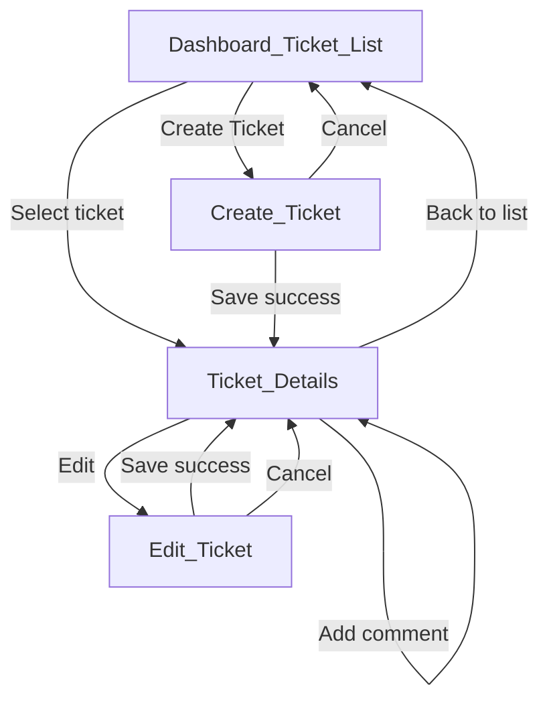

# UI Flow

**Scope:** Core only  
**Traces to:** [requirements-analysis.md](requirements-analysis.md), [acceptance-criteria.md](acceptance-criteria.md), [api-contract.md](api-contract.md)

User interface flow for the Core implementation using ASP.NET Core MVC. This document describes screen behavior, navigation, and user interactions — not markup or implementation.

---

## Screen Overview

| Screen | Purpose | Entry Points |
|--------|---------|--------------|
| Dashboard / Ticket List | Browse, search, and filter all tickets | Application home / default route |
| Create Ticket | Submit a new support ticket | Action from ticket list |
| Ticket Details | View full ticket, comments, change status, add comment | Select ticket from list |
| Edit Ticket | Update title, description, priority, assignee | Link from ticket details |
| Change Ticket Status | Transition ticket through lifecycle | Section on ticket details |
| Add Comment | Post a message on a ticket | Section on ticket details |

Change Ticket Status and Add Comment are workflows on the Ticket Details screen, not separate pages.

There is no login screen in Core (BR-09). The default landing page is the ticket list.

---

## Navigation Flow

Persistent layout includes application title and a navigation link back to the ticket list from all screens.

---

## Cross-Cutting Concerns

### Form Validation

- Server-side validation is authoritative; client-side checks are supplementary (NFR-04, AC-09)
- After a failed submit, field-level error messages appear next to the invalid fields
- A validation summary appears at the top of the form when errors exist
- Whitespace-only text is treated as empty

**Required fields by form:**

| Form | Required Fields |
|------|-----------------|
| Create Ticket | Title, priority, assignee, creator |
| Edit Ticket | Title, priority, assignee |
| Add Comment | Message, creator |

### Error Handling

| Scenario | User Experience |
|----------|-----------------|
| Validation failure | Field errors and summary; form retains entered values |
| Ticket not found | Dedicated not-found message with link back to ticket list |
| Invalid status transition | Prominent error on ticket details; status unchanged |
| Unexpected failure | Generic user-friendly message; no stack traces or internal details (AC-10) |

### Success Messages

| Action | User Experience |
|--------|-----------------|
| Create ticket | Redirect to ticket details with confirmation message |
| Edit ticket | Redirect to ticket details with confirmation message |
| Change status | Refresh ticket details with confirmation message |
| Add comment | Refresh ticket details; new comment visible with confirmation message |

---

## Search and Filter Workflow

On the Dashboard / Ticket List (AC-07, AC-08):

1. User enters an optional keyword in the search field (matches title or description)
2. User selects an optional status from the filter dropdown (includes an "All" option)
3. User applies filters via an explicit action (e.g., Search or Apply button)
4. List updates to show only matching tickets
5. Empty or omitted keyword applies no text filter
6. No matches shows an empty-state message — not an error
7. Search and status filter work together
8. Clearing filters and re-applying restores the full list

---

## State Transition Workflow

On Ticket Details (AC-05):

1. Current status is displayed prominently
2. Only valid next statuses are offered as selectable options:

| Current Status | Options Shown |
|----------------|---------------|
| Open | In Progress, Cancelled |
| In Progress | Resolved, Cancelled |
| Resolved | Closed |
| Closed | None (terminal) |
| Cancelled | None (terminal) |

3. User selects a target status and confirms the change
4. On success: status updates, available options refresh, success message shown
5. On failure: error message explains the transition is not allowed (e.g., "Cannot change status from Closed to Open"); status and options remain unchanged

---

## UI-01: Dashboard / Ticket List

**Traces to:** AC-02, AC-07, AC-08

### Displays

- Table or list of tickets showing: title, status, priority, assignee, last updated date
- Search input field
- Status filter dropdown (All, Open, In Progress, Resolved, Closed, Cancelled)
- Apply filters action
- Create Ticket action
- Empty-state message when no tickets exist or no matches found

### User Interactions

- Click ticket title or row to open ticket details
- Click Create Ticket to open create form
- Enter search keyword and/or select status filter, then apply

### Errors

- If the list fails to load, show a user-friendly error with guidance to refresh or try again

---

## UI-02: Create Ticket

**Traces to:** AC-01

### Displays

- Title (text input)
- Description (optional text area)
- Priority (dropdown: Low, Medium, High)
- Assignee (dropdown populated from seeded users)
- Creator (dropdown populated from seeded users)
- Submit and Cancel actions

### User Interactions

- Submit saves the ticket with status Open
- Cancel returns to ticket list without saving

### Validation

- Title required, non-empty, max 200 characters
- Priority, assignee, and creator required
- Description optional, max 4000 characters

### Success

- Redirect to ticket details for the newly created ticket with a confirmation message

---

## UI-03: Ticket Details

**Traces to:** AC-03

### Displays

- Title, description, priority, status, assignee name, creator name
- Created and updated timestamps
- Comments list (message, author name, date) ordered oldest first
- Edit action
- Back to list action
- Change Ticket Status section (see UI-05)
- Add Comment section (see UI-06)

### User Interactions

- Edit navigates to edit ticket screen
- Back to list returns to dashboard

### Errors

- If ticket ID does not exist, show not-found message with link to ticket list

---

## UI-04: Edit Ticket

**Traces to:** AC-04

### Displays

- Pre-filled form: title, description, priority, assignee
- Status shown read-only (not editable on this screen)
- Submit and Cancel actions

### User Interactions

- Submit saves changes and updates the updated timestamp
- Cancel returns to ticket details without saving

### Validation

- Title required, non-empty, max 200 characters
- Priority and assignee required
- Description optional, max 4000 characters

### Success

- Redirect to ticket details with confirmation message

---

## UI-05: Change Ticket Status

**Traces to:** AC-05

**Location:** Section on ticket details screen

### Displays

- Current status label
- Selector showing only valid next statuses (see State Transition Workflow)
- Submit action to apply change
- Hidden or disabled when ticket is in a terminal state (Closed, Cancelled)

### User Interactions

- Select target status and submit
- Page refreshes with updated status on success

### Errors

- Invalid transition shows error message; status remains unchanged

### Success

- Status updates; available options refresh; confirmation message shown

---

## UI-06: Add Comment

**Traces to:** AC-06

**Location:** Section on ticket details screen, below comments list

### Displays

- Message text area
- Creator dropdown (seeded users)
- Submit action

### User Interactions

- Submit adds comment to the ticket
- Page refreshes with new comment visible

### Validation

- Message required, non-empty, max 4000 characters
- Creator required

### Success

- New comment appears in comments list chronologically; confirmation message shown

---

## Traceability

| Screen / Workflow | Acceptance Criteria |
|-------------------|---------------------|
| Dashboard / Ticket List | AC-02, AC-07, AC-08 |
| Create Ticket | AC-01 |
| Ticket Details | AC-03 |
| Edit Ticket | AC-04 |
| Change Ticket Status | AC-05 |
| Add Comment | AC-06 |
| Form validation (all forms) | AC-09 |
| Error handling (all screens) | AC-10 |
