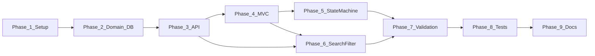

# Implementation Plan

Part C — Submission artifact for the .NET AI Capability Assessment.  
Adapted from [`docs/implementation-plan.md`](docs/implementation-plan.md). Scope: **Core only**.

**Traces to:** [`design-notes.md`](design-notes.md), [`api-contract.md`](api-contract.md), [`ui-flow.md`](ui-flow.md), [`acceptance-criteria.md`](acceptance-criteria.md), [`docs/architecture.md`](docs/architecture.md)

**Status:** Core phases 1–9 complete. Build and integration tests pass. See `tool-specific/cursor-workflow/test-results.md`.

---

## Overview

Phased delivery plan for the Core implementation (~5 focused hours of application work). Each phase produces a verifiable increment. Stretch features are deferred until all Core acceptance criteria pass.

A single ASP.NET Core application hosts MVC and Web API over Application services, Domain rules, and EF Core + SQLite. Delivery order: solution setup → domain and database → API → MVC → state machine → search/filter → validation → integration tests → documentation.

State machine rules are defined in Domain during Phase 2 and fully enforced in Phase 5. Search and filter extend the existing list endpoint in Phase 6. Validation is hardened in Phase 7 after features exist. Integration tests run in Phase 8 once the state machine and validation are complete.

**Out of scope for this plan:** Stretch features (authentication, pagination, Swagger, Docker, user CRUD); lifecycle artifacts beyond README and database setup notes until Core acceptance criteria pass.

---

## Task Breakdown

Detailed task IDs (T-01–T-27) live in [`tool-specific/cursor-workflow/tasks.md`](tool-specific/cursor-workflow/tasks.md). Summary by implementation phase:

### Phase 1: Solution and Project Setup

| Deliverable | Outcome |
|-------------|---------|
| Solution with Domain, Application, Infrastructure, Web, and Tests | Correct references and inward dependency direction |
| Feature-grouped folders; SQLite config placeholder | Layout matches architecture; no secrets committed |
| README stub | Planned setup and run instructions |

### Phase 2: Domain Model and Database

| Deliverable | Outcome |
|-------------|---------|
| User, Ticket, Comment entities; TicketStatus, Priority enums | Domain model per data-model |
| State transition rules in Domain | BR-01–BR-03 defined before enforcement |
| DbContext, configurations, initial migration, seed | DB created on startup; data persists across restart |

### Phase 3: Backend API

| Deliverable | Outcome |
|-------------|---------|
| Application services, DTOs, repositories | Use cases callable from API and MVC |
| Ticket create/list/detail/update and comment create endpoints | JSON shapes match api-contract |
| Status PATCH stub or basic | Full enforcement in Phase 5 |

### Phase 4: MVC UI

| Deliverable | Outcome |
|-------------|---------|
| Controllers, view models, Bootstrap 5 views | List, create, details, edit per ui-flow |
| Layout with navigation to ticket list | Browser flows for CRUD and comments (UI-01–UI-04, UI-06) |

### Phase 5: State Machine

| Deliverable | Outcome |
|-------------|---------|
| Transition validation in Application using Domain rules | Signature judgment piece enforced server-side |
| Full `PATCH /api/tickets/{id}/status` (409 on invalid) | Valid transitions succeed; terminal states show no options |
| Status change section on ticket details | UI offers only valid next statuses |

### Phase 6: Search and Filtering

| Deliverable | Outcome |
|-------------|---------|
| `search` and `status` on list API; combined repository query | FR-11–FR-13 |
| Search/filter controls and empty-result state on list UI | Keyword + status combinable; empty keyword = all tickets |

### Phase 7: Validation and Error Handling

| Deliverable | Outcome |
|-------------|---------|
| Validation on create, update, comment, status inputs | Per api-contract validation table |
| Consistent ErrorResponse; MVC field/summary errors | AC-09, AC-10; forms retain values on failure |
| Not-found handling; global exception handler | No stack traces exposed to users |

### Phase 8: Integration Testing

| Deliverable | Outcome |
|-------------|---------|
| xUnit + WebApplicationFactory state-machine tests | Valid transitions succeed; invalid return 409 |
| `test-results.md` with `dotnet test` output | Assessment criterion #11 |

### Phase 9: Documentation Review

| Deliverable | Outcome |
|-------------|---------|
| README and `database/setup-notes.md` | Clean-machine setup, run, and test |
| Planning docs verified against implementation | Core ready for remaining lifecycle artifacts |

### Phase dependency summary

| Phase | Depends On | Unblocks |
|-------|------------|----------|
| 1. Setup | Planning docs | Phase 2 |
| 2. Domain and DB | Phase 1 | Phase 3 |
| 3. Backend API | Phase 2 | Phases 4, 6 |
| 4. MVC UI | Phase 3 | Phases 5, 6 |
| 5. State Machine | Phases 3, 4 | Phases 7, 8 |
| 6. Search and Filter | Phases 3, 4 | Phase 7 |
| 7. Validation | Phases 3–6 | Phase 8 |
| 8. Integration Tests | Phases 5, 7 | Phase 9 |
| 9. Documentation Review | Phases 1–8 | Submission |

---

## Milestones

| Milestone | When | Exit criteria |
|-----------|------|---------------|
| **M1 — Foundation** | End of Phases 1–2 | Solution builds; SQLite migrations and seed users available |
| **M2 — API vertical slice** | End of Phase 3 | Core CRUD and comments callable via API; contract shapes match |
| **M3 — UI vertical slice** | End of Phase 4 | Create, list, view, edit tickets and add comments in browser |
| **M4 — Signature rules** | End of Phase 5 | All five valid transitions succeed; invalid rejected in API and MVC |
| **M5 — Discoverability** | End of Phase 6 | Keyword search and status filter work alone and combined |
| **M6 — Hardened quality** | End of Phase 7 | Validation and user-facing errors meet AC-09 / AC-10 |
| **M7 — Test evidence** | End of Phase 8 | `dotnet test` passes; results recorded |
| **M8 — Submission-ready Core** | End of Phase 9 | README works on a clean machine; docs aligned with behavior |

Stretch work (e.g., Identity auth, theme toggle) starts only after Core acceptance criteria pass.

---

## AI Usage Plan

Primary tool: **Cursor** (Plan Mode for design/planning; Agent Mode for scoped implementation). Context sources: `.cursor/rules/project-rules.md`, `tool-specific/cursor-workflow/project-context.md`, and approved `docs/` / root Part C artifacts.

| Lifecycle stage | AI use |
|-----------------|--------|
| Requirement analysis | Draft FR/NFR and acceptance criteria from project context; human review keeps state machine and mandatory tests non-negotiable |
| Planning and design | Produce architecture, data model, API/UI contracts, and this plan before application code |
| Code generation | Implement one phase at a time against approved contracts; thin controllers; DTOs at boundaries |
| Validation | After each phase: build, manual MVC checks, confirm invalid transitions rejected |
| Testing | Generate/refine xUnit state-machine integration tests; record output in test-results |
| Debugging / review | Root-cause hypotheses by layer; treat AI output as draft; sync docs when behavior changes |

**Not shared with AI:** secrets, production credentials, unnecessary PII, or instructions that bypass validation or assessment integrity. Prompt history exported under `ai-prompts/`. Full workflow: [`tool-workflow.md`](tool-workflow.md).

---

## Risks

| Risk | Impact |
|------|--------|
| State machine logic leaks into controllers or views | Harder to test; fails signature judgment expectation |
| Scope creep into Stretch before Core is done | Misses assessment Core criteria under time pressure |
| Incomplete or inconsistent validation between API and MVC | AC-09 / AC-10 failures; confusing UX |
| Integration tests share state or differ from file SQLite | Flaky or misleading test evidence |
| Planning docs drift from implemented behavior | Submission artifacts misrepresent the system |
| Over-abstraction or extra dependencies | Slows delivery; conflicts with project conventions |

---

## Mitigation

| Risk | Mitigation |
|------|------------|
| State machine placement | Define rules in Domain; enforce in Application; Phase 5 before declaring Core complete |
| Scope creep | Explicit out-of-scope list; phases gate Stretch until Core acceptance criteria pass |
| Validation consistency | Shared Application validation; Phase 7 hardening against api-contract table |
| Test isolation | WebApplicationFactory with separate test DB / migrations; assert HTTP status and body, not internals |
| Doc drift | Phase 9 verification; update README and setup notes against real run steps |
| Over-engineering | Follow project-rules; minimal interfaces; no new dependencies without justification |

Detailed test risks and mitigations: [`docs/test-strategy.md`](docs/test-strategy.md). Source phase narrative remains in [`docs/implementation-plan.md`](docs/implementation-plan.md).
