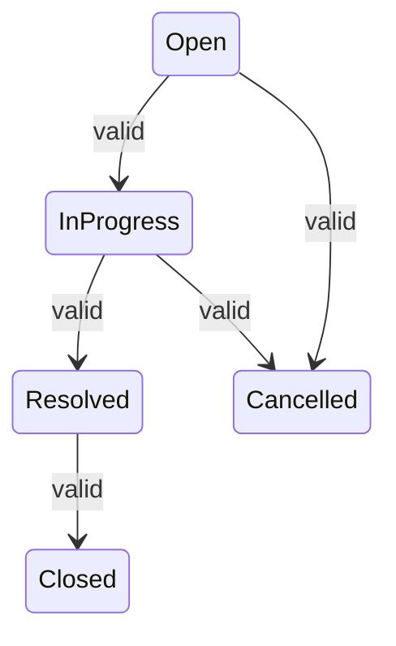

# Requirements Analysis

Part C — Submission artifact for the .NET AI Capability Assessment.  
Adapted from [`docs/requirements-analysis.md`](docs/requirements-analysis.md). Scope: **Core only**.

---

## Selected Project Option

**Option 1 — Backend-Heavy Support Ticket Management System**

An internal support ticket application with ASP.NET Core MVC (UI), ASP.NET Core Web API (REST), EF Core + SQLite (persistence), and Bootstrap 5. Core delivery includes ticket create/list/detail/update, comments, keyword search and status filter, server-side validation, and an enforced ticket status state machine.

---

## My Understanding

An internal support ticket application where users create tickets, assign them to colleagues, add comments, and progress tickets through a defined lifecycle. Users exist as seeded data only — there is no login or user-management UI in Core. The central requirement is an enforced status state machine: only valid transitions succeed, invalid transitions are rejected by the backend, and the user receives clear feedback when a transition is not allowed.

---

## Functional Requirements

### Ticket Management

| ID | Requirement |
|----|-------------|
| FR-01 | A user can create a ticket with title, description, priority, assignee, and creator |
| FR-02 | New tickets are created in `Open` status |
| FR-03 | A user can view a list of all tickets from persistent storage |
| FR-04 | A user can open a ticket detail view showing all ticket fields, timestamps, and related comments |
| FR-05 | A user can update mutable ticket fields: title, description, priority, and assignee |

### Status Lifecycle

| ID | Requirement |
|----|-------------|
| FR-06 | A user can change a ticket's status only through the defined valid transitions |
| FR-07 | Invalid status transitions are rejected by the backend |
| FR-08 | When a status transition is rejected, the user receives clear, meaningful feedback |

**Valid transitions:**

| From | To |
|------|-----|
| Open | In Progress |
| Open | Cancelled |
| In Progress | Resolved |
| In Progress | Cancelled |
| Resolved | Closed |

All other transitions are invalid. `Closed` and `Cancelled` are terminal states.

### Comments

| ID | Requirement |
|----|-------------|
| FR-09 | A user can add a comment to an existing ticket |
| FR-10 | Ticket detail displays all comments with message, creator, and creation timestamp |

### Search and Filter

| ID | Requirement |
|----|-------------|
| FR-11 | A user can search tickets by keyword (title and description at minimum) |
| FR-12 | A user can filter the ticket list by status |
| FR-13 | Keyword search and status filter can be applied together |

### Data and Users

| ID | Requirement |
|----|-------------|
| FR-14 | All tickets and comments are persisted; data survives application restart |
| FR-15 | Users are available from seeded data (id, name, email, role) and selectable as creator or assignee |
| FR-16 | No user-management UI in Core — users cannot be created, edited, or deleted through the application |

### Validation and Errors

| ID | Requirement |
|----|-------------|
| FR-17 | The backend rejects invalid or incomplete input before persisting changes |
| FR-18 | The application displays meaningful error feedback for validation failures, not-found resources, and rejected status transitions |

### Business Rules (enforced with the above)

| ID | Rule |
|----|------|
| BR-01 | Ticket status follows a strict finite state machine with exactly five valid transitions |
| BR-02 | Any transition not explicitly listed is invalid and must be rejected server-side |
| BR-03 | `Closed` and `Cancelled` are terminal states — no further status transitions are permitted |
| BR-04 | A ticket must have a non-empty title on create; other required fields are enforced at the backend |
| BR-05 | A comment must reference an existing ticket and include a non-empty message and a creator |
| BR-06 | Assignee and creator must reference a user that exists in seeded data |
| BR-07 | User records are read-only in Core — no create, update, or delete operations on users |
| BR-08 | Keyword search and status filter operate against persisted ticket data |
| BR-09 | No authentication or authorization checks in Core — all operations are available without login |

---

## Non-Functional Requirements

| ID | Category | Requirement |
|----|----------|-------------|
| NFR-01 | Architecture | Full-stack delivery: MVC frontend, Web API backend, and database persistence |
| NFR-02 | Persistence | Data stored in SQLite via EF Core; setup and seed scripts provided |
| NFR-03 | Reliability | Data remains available after application restart — no in-memory-only storage |
| NFR-04 | Validation | Server-side validation is authoritative; any client-side checks are supplementary |
| NFR-05 | Security | No secrets committed to source control; local credentials via configuration or user secrets |
| NFR-06 | Usability | English-only UI; failed operations produce clear, user-facing error states |
| NFR-07 | Scope | Core deliverable scoped to approximately 5 focused hours; no Stretch features required for Core |
| NFR-08 | Operability | README provides setup instructions that work on a clean machine |
| NFR-09 | Maintainability | Lightweight Clean Architecture with separated concerns across layers |

State-machine correctness must be verifiable via integration tests (valid transitions succeed; invalid transitions are rejected).

---

## Assumptions

- Single-tenant internal application with one logical organization
- Users are seeded at application startup with enough records to support assignee selection
- Priority is a discrete value (e.g., Low, Medium, High); exact values are defined in the data model
- `createdBy` is set at ticket creation; `createdAt` and `updatedAt` are set by the system
- Comments are append-only in Core — no edit or delete of existing comments
- Field updates are permitted on tickets in any status unless a later design decision restricts terminal states
- MVC UI is the primary interaction surface; the API exposes the same business capabilities
- No concurrent-user conflict resolution beyond last-write-wins at assessment scale
- Ticket deletion is not a Core feature — missing tickets are treated as not found

---

## Clarifications

| Topic | Clarification |
|-------|---------------|
| Core vs Stretch | Core is mandatory. Stretch (auth, richer filters, Swagger, Docker/CI, unit tests beyond the mandatory tier) is optional and deferred until Core acceptance criteria pass. |
| Users | Seeded only in Core. No user CRUD UI. Assignee and creator must reference existing seeded users. |
| Authentication | Not required in Core. All ticket operations are available without login for the Core deliverable. |
| Status machine | Five valid transitions only. All others rejected server-side. Terminal states (`Closed`, `Cancelled`) accept no further status changes. |
| Validation authority | Backend validation is authoritative. Client-side checks may improve UX but must not be the sole enforcement. |
| Search behaviour | Empty or whitespace keyword applies no keyword constraint (returns all tickets, subject to any active status filter). |
| Persistence | SQLite via EF Core. In-memory-only storage does not satisfy Core. |
| Secrets | No secrets in source control. Local setup must not require committed credentials. |
| Out of document scope | This analysis does not define database schema, API contracts, or UI layouts — those live in separate design artifacts. |

---

## Edge Cases

### Status Transitions

- Attempting `Closed → Open`, `Resolved → In Progress`, or `Open → Closed` (skipping intermediate states)
- Attempting any transition from `Cancelled` or `Closed`
- Changing status on a ticket that does not exist

### Validation

- Empty or whitespace-only title or description on create or update
- Missing priority or assignee on ticket create
- Comment with empty or whitespace-only message
- Comment submitted for a non-existent ticket

### Search and Filter

- Keyword or status filter returns no matching tickets (empty result set)
- Search with empty or whitespace keyword — expected behaviour: return all tickets (no keyword constraint applied)
- Combined search and filter yield no results

### Data Integrity

- Assignee or creator references a user ID not present in seeded data
- Ticket detail requested for an ID that does not exist

### Persistence

- Data written in one session is available after application restart
- Fresh database is populated via seed data (users required; sample tickets optional)
