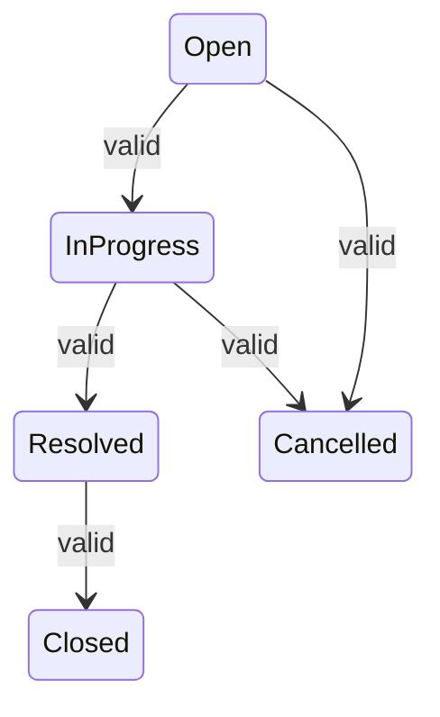
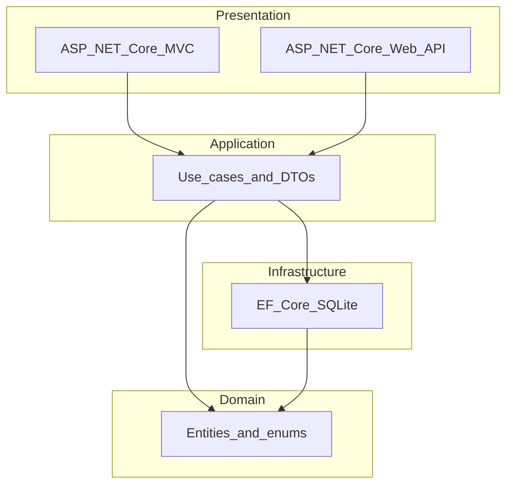

# Project Context

Persistent project context for the Support Ticket Management System — Option 1 of the .NET AI Capability Assessment. This document is the primary source of truth for all planning, implementation, and AI collaboration in this repository.

**Primary AI tool:** Cursor  
**Current state:** Core application implemented (MVC, API, persistence, state machine, search/filter, validation, integration tests). Lifecycle artifacts in progress.

---

## Project Overview

A backend-heavy Support Ticket Management System built as part of the .NET AI Capability Assessment. The application lets internal users create, update, comment on, search, and progress support tickets through a defined lifecycle. The project demonstrates effective, responsible AI-assisted engineering across the full software development lifecycle — not just code generation.

---

## Business Context

A small internal application for managing support tickets. Users create tickets, assign them, add comments, and move them through status stages. Users are seeded in the database; no user-management UI is required in Core.

The signature engineering judgment piece is the **enforced ticket status state machine**: valid transitions must succeed, invalid transitions must be rejected by the backend, and the UI must handle rejection clearly.

---

## Assessment Objective

This exercise demonstrates how AI tools are used thoughtfully across requirement analysis, planning, implementation, testing, debugging, code review, documentation, and reflection. It is **not a graded test** — feedback focuses on workflow quality, understanding, and ownership, not only whether the app runs.

| Part | Focus | Effort emphasis |
|------|-------|-----------------|
| Part A | AI Workflow Foundation | 20% |
| Part B | Full-Stack Mini Project (Core + optional Stretch) | 60% |
| Part C | Submission and Reflection | 20% |

- **Core application:** roughly 5 focused hours.
- **Lifecycle artifacts:** remaining time — prompt history, testing notes, debugging notes, reflection, and related documentation. These are as important as the application itself.

---

## Core Scope (Mandatory)

### Entities

| Entity | Key fields | Notes |
|--------|-----------|-------|
| User | id, name, email, role | Seeded only — no user-management UI |
| Ticket | id, title, description, priority, status, assignedTo, createdBy, createdAt, updatedAt | |
| Comment | id, ticketId, message, createdBy, createdAt | |

### Features

- Create a ticket
- List tickets
- View ticket detail
- Update ticket fields (title, description, priority, assignee)
- Change ticket status through the enforced state machine
- Add comments to a ticket
- Keyword search and filter by status
- Persist all data; data survives application restart
- Validate required fields; reject invalid input at the backend
- Show meaningful error states in the UI

### Status State Machine



| From | To | Valid |
|------|-----|-------|
| Open | In Progress | Yes |
| In Progress | Resolved | Yes |
| Resolved | Closed | Yes |
| Open | Cancelled | Yes |
| In Progress | Cancelled | Yes |
| All other transitions | — | **No — rejected by backend** |

### Mandatory Test Tier

Integration tests that prove state-machine rules: valid transitions succeed, invalid transitions are rejected.

### Common Technical Requirements

Every submission must include:

- Frontend application (ASP.NET Core MVC)
- Backend API (ASP.NET Core Web API)
- Database persistence (SQLite via EF Core)
- Database setup or migration scripts and seed data
- Input validation and error handling
- At least one working search or filter capability (keyword search + status filter)
- README with setup instructions
- Full prompt history and lifecycle artifacts in the repository

---

## Stretch Scope — Out of Scope Until Core Is Complete

> **Do not start Stretch work until all Core acceptance criteria are met.** Stretch is optional evidence of advanced practice; a clean, well-documented Core alone is a strong result.

| Area | Examples |
|------|----------|
| Data model | Third entity or richer data model |
| Users | Full user CRUD and role management |
| Security | Authentication, protected routes, API authorization |
| Search and listing | Filter by priority and assignee; sorting; pagination |
| Testing | Unit tests; edge-case and failure tests |
| API docs | Swagger / OpenAPI |
| DevOps | Docker setup, CI workflow |
| AI workflow | Reusable prompt templates, rules, or specs |

---

## Functional Summary

High-level user-facing flows (no API or implementation detail):

1. **Browse tickets** — view a list with keyword search and status filter
2. **Create a ticket** — provide title, description, priority, and assignee
3. **View ticket detail** — see fields, status, assignee, timestamps, and comments
4. **Update a ticket** — change title, description, priority, or assignee
5. **Change status** — transition through valid states; receive clear feedback on invalid attempts
6. **Add comments** — post messages on a ticket

---

## High-Level Architecture

Lightweight Clean Architecture using Domain, Application, Infrastructure, and Presentation layers.



**Principles:**

- Thin controllers; business logic lives in the Application layer
- Domain has no framework dependencies
- State machine rules enforced in Application or Domain — not in Razor views
- MVC and API both delegate to Application services
- Detailed layering and conventions: see `.cursor/rules/project-rules.md`

---

## Technology Stack

| Layer | Choice |
|-------|--------|
| Runtime | .NET 8 |
| UI | ASP.NET Core MVC, Bootstrap 5 |
| API | ASP.NET Core Web API |
| ORM | Entity Framework Core |
| Database | SQLite |
| Testing | xUnit |
| AI tool | Cursor |

---

## Repository Structure

Assessment-required layout mapped to this repository:

```
support-ticket-management/
README.md
docs/
src/
tests/
database/
ai-prompts/
tool-specific/
.cursor/
```

---

## Development Workflow

1. **Context and planning** — populate cursor-workflow artifacts, lifecycle docs, acceptance criteria
2. **Data model and API contract** — design before coding
3. **Core implementation** — entities, persistence, API, MVC UI, state machine
4. **Testing** — state-machine integration tests (mandatory tier)
5. **Validation and polish** — error states, README, clean-machine setup verification
6. **Lifecycle artifacts** — prompt history, debugging notes, reflection, PR description
7. **Stretch** — only after all Core acceptance criteria pass

**Workflow rules:**

- Plan before implementing significant changes
- Keep commit history organized and traceable
- Never commit secrets to the repository
- Do not expand the Core application at the expense of lifecycle artifacts

---

## Documentation Strategy

| Artifact | Purpose |
|----------|---------|
| `project-context.md` | Persistent what-and-why context (this file) |
| `spec.md` | Detailed functional and technical specification (content in `docs/api-contract.md`, `docs/ui-flow.md`, `docs/data-model.md`) |
| `tasks.md` | Implementation task breakdown |
| Root lifecycle markdown files | Requirement analysis, design, testing, reflection per assessment guide |
| `ai-prompts/` | Grouped prompt history with iteration evidence |
| `README.md` | Setup, run, and test instructions |
| `.cursor/rules/project-rules.md` | Coding conventions and AI guardrails |

Update related documents when design or behavior changes. Planning documents are created as part of the assessment workflow, not ad hoc.

---

## Testing Strategy

| Tier | Scope | Status |
|------|-------|--------|
| Core (mandatory) | Integration tests for ticket status state machine — valid transitions succeed, invalid transitions rejected | **Complete** (22/22 passing; see `tool-specific/cursor-workflow/test-results.md`) |
| Stretch (deferred) | Unit tests; edge-case and failure tests; broader coverage | Out of scope until Core complete |

- Record test results in `test-results.md` (lifecycle artifact)
- Follow naming and conventions in `.cursor/rules/project-rules.md`
- Add or update tests whenever behavior changes

---

## AI Collaboration Workflow

1. **Load context first** — `project-context.md` is the primary context for every AI session
2. **Scope from approved artifacts** — reference `spec.md` and `tasks.md` for implementation boundaries
3. **Follow project rules** — conventions in `.cursor/rules/project-rules.md`
4. **Plan before building** — use plan mode for significant implementation work
5. **Log prompt history** — capture prompts in `ai-prompts/` grouped by activity (planning, design, implementation, testing, debugging, code review, documentation)
6. **Validate and own output** — document what was accepted, changed, or rejected and why
7. **Protect sensitive data** — do not share secrets, credentials, or unnecessary personal data with AI tools

---

## Assumptions

- Single-tenant internal application (no multi-tenancy)
- Users seeded at startup; no login or authentication in Core
- SQLite is sufficient for local development and assessment submission
- One developer, self-paced, within approximately one week
- MVC UI is the primary frontend; API supports the UI and integration tests
- English-only UI

---

## Constraints

- Core scoped to 5 focused hours — lifecycle artifacts must not be sacrificed for feature expansion
- No authentication in Core
- No secrets in source control
- State machine rules are non-negotiable and must be enforced server-side
- Stretch features are blocked until Core is complete
- Full assessment artifact set required at submission regardless of Stretch completion
- Authentication, if added in Stretch, must be implemented well to count as evidence

---

## Success Criteria

### Core Acceptance Criteria

- [x] A user can create a ticket via the UI
- [x] A user can view all tickets from the database
- [x] A user can open a ticket detail view
- [x] A user can update ticket fields and reassign
- [x] A user can add comments
- [x] Status changes only through valid transitions; invalid ones are rejected
- [x] Keyword search and status filter work
- [x] Data remains available after restart
- [x] Backend validation prevents invalid records
- [x] No secrets committed to the repository
- [x] State-machine integration tests pass

### Submission Readiness

- [x] README setup instructions work on a clean machine
- [x] Lifecycle artifacts present (requirement analysis, design notes, test strategy, test results)
- [ ] Full prompt history captured in `ai-prompts/` (planning prompts present; implementation/testing prompts to be added)
- [ ] PR description and reflection completed
